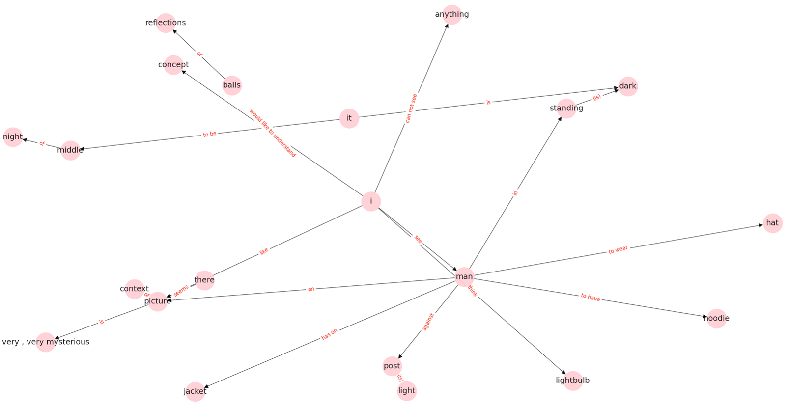

# Netspy - Networks of Transcribed Speech in Python
Toolbox for constructing semantic speech networks from speech transcripts.

This toolbox was built as part of an ongoing project investigating the potential of [speech markers to predict psychosis risk](https://www.turing.ac.uk/research/research-projects/towards-incoherent-speech-predictor-psychosis-risk) funded by the [Alan Turing Institute](https://www.turing.ac.uk) and led by [Sarah Morgan](https://www.neuroscience.cam.ac.uk/directory/profile.php?SarahMorgan) at the [University of Cambridge](https://www.cam.ac.uk). Tools were written by [Caroline Nettekoven](https://www.neuroscience.cam.ac.uk/directory/profile.php?caronettekoven) at the  [Cambridge Brain Mapping Unit](http://www.bmu.psychiatry.cam.ac.uk).

The algorithms in this toolbox create a semantic speech graph from transcribed speech. Speech transcripts are short paragraphs of largely raw, uncleaned speech-like text. For example:

> 'I see a man in the dark standing against a light post. It seems to be in the middle of the night; I think because the lightbulb is working. On the picture there seems to be like a park and... Or trees but in those trees there are little balls of light reflections as well. I cannot see the… Anything else because it’s very dark. But the man on the picture seems to wear a hat and, and has a jacket on and he seems to have a hoodie on as well. The picture is very, very mysterious, which I like about it, but for me I would like to understand more concept, context of the picture.'
> -- <cite>Example Transcript</cite>

Below is the semantic speech graph constructed from this text.


*Figure 1. Semantic Speech Graph. Nodes represents an entity mentioned by the speaker (e.g. I, man, jacket). Edges represent relations between nodes mentioned by the speaker (e.g. see, has on).*

## Dependencies

### Python dependencies

To get started install [Poetry](https://python-poetry.org/docs/).

Then ensure all dependencies are installed:

```bash
poetry install
```

### [OpenIE5](https://github.com/dair-iitd/OpenIE-standalone/tree/v5.0.1) and language models

Download precompilled binary from [here](https://drive.google.com/file/d/19z8LO-CYOfJfV5agm82PZ2JNWNUPIB6D/view?usp=sharing) and place in the project root directory.

Create a folder called `data`

```bash
mkdir legacy/data
```

Download the language model from [here](https://drive.google.com/file/d/0B-5EkZMOlIt2cFdjYUJZdGxSREU/view?usp=sharing) and place in the data folder. 

## Pipeline
### 1. Construct semantic graphs.
  Start OpenIE5 server.
  ```bash
  java -Xmx20g -XX:+UseConcMarkSweepGC -jar openie-assembly-5.0-SNAPSHOT.jar  --ignore-errors --httpPort 6000
  ```
  To create a semantic graph for a single transcript in the dataset, run
  ```console
  poetry run python legacy/speech_graph.py demo_data/3138838-TAT10.txt
  ```
  Output:
  - log file (.txt file)
  - pickled graph (.gpickle file)
  - plotted graph (.png file)
    
  To create semantic graphs for a whole dataset of transcripts, ammend the graph_tats.sh script and run
  ```console
  graph_tats.sh
  ```
  Output:
  - For each transcript in dataset
    - log file (.txt file)
    - pickled graph (.gpickle file)
    - plotted graph (.png file)
  - Summary report for full dataset, including
    - Number of transcripts in dataset, number of processed transcripts in this round, number of errors encountered
    - Detailed error report for each transcript where processing finished with an error

### 2. Describe semantic graphs
  ```console
  python describe_graphs.py <graph_dir>
  ```
  Output: graphs_data.csv
  
### 3. Plot basic graph measures
Plots of all basic graph measures are available in the basic_graph_analysis.ipynb notebook
  - Change graph_dir variable to the folder containing all pickled graphs (e.g. graph_dir = <graph_dir>)
  
### 4. Count graph motifs
  ```console
  python motifs.py <graph_dir>
  ```
  Output: motif_counts.csv

### 5. Plot motif counts
Plots of all motif count measures are available in the  motif_analysis.ipynb notebook

## Additional Measures
Calculating additional measures for the transcripts to compare semantic graph measures with.

### 1. Syntactic graph measures
Use SpeechGraph tool from Natalia Mota to construct and describe syntactic measures

### 2. NLP measures
Use [NLP_psychosis](https://github.com/carobellum/NLP_psychosis) tools to calculate measures. 

### 3. Compile all data into one table
To compile all data (semantic graph data, syntactic graph data, nlp data) into one table, run
```console
python compile_all_graph_data.py <graph_dir>
```
Output:
- graphs_data_all.csv


