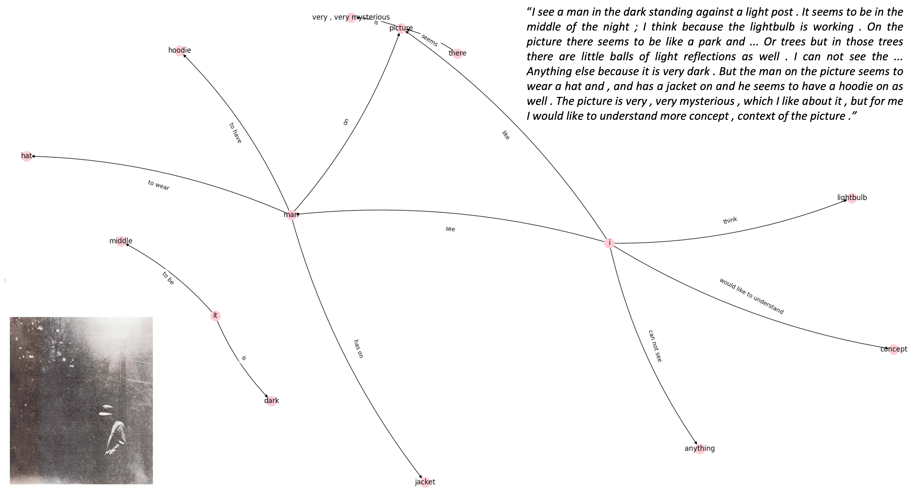

# Welcome to netts

Network of Transcript Semantics (netts) creates networks capturing the semantic content of speech.

{ width="95%" }

    <em>Network of Transcript Semantics</em>

<!-- Figure is commented out until copyright issues are clear -->
<!-- 

    <em>Network of Transcript Semantics</em>

 -->

---

**Documentation**: [https://alan-turing-institute.github.io/netts/](https://alan-turing-institute.github.io/netts/)

**Source Code**: [https://github.com/alan-turing-institute/netts](https://github.com/alan-turing-institute/netts)

---

## About

Netts is package for analysing the content of natural speech.
It maps the content of speech as a network and analyses the network using graph theory.
The networks are referred to as **semantic speech networks**.
This is novel analysis method for speech data has provided new insight on speech alterations in psychiatric conditions.

Netts uses Natural Language Processing (NLP) to construct speech networks from transcripts of spoken text (e.g. <em>I see a man</em>).
Nodes represent entities (e.g. <em>I</em>, <em>man</em>) and edges represent relations between nodes (e.g. <em>see</em>).

<!-- Alternative pipeline placeholder image -->
<!-- 

    <em>Netts pipeline.</em>

 -->

<!-- Figure is commented out until copyright issues are clear -->

<!-- 

    <em>netts pipeline</em>

 -->

The tool is freely available as a python package and accessible online. It can be installed from the python package index PyPI, see [Getting Started](install.md) for installation instructions.
Netts can be used to construct a semantic speech network from a text file with a single command. See [CLI usage](cli_basics.md) for a user guide.
For a detailed explanation of the processing pipeline, see [Pipeline](pipeline.md).

## Contributors

Netts was written by [Caroline Nettekoven](https://www.caroline-nettekoven.com) in collaboration with [Sarah Morgan](https://semorgan.org).

Netts was packaged in collaboration with [Oscar Giles](https://www.turing.ac.uk/people/researchers/oscar-giles), [Iain Stenson](https://www.turing.ac.uk/research/research-engineering/meet-the-team) and [Helen Duncan](https://www.turing.ac.uk/people/research-engineering/helen-duncan).

<!-- ## Citing netts

If you use netts in your work, please cite this paper:
> Caroline R. Nettekoven, Kelly Diederen, Oscar Giles, Helen Duncan, Iain Stenson, Julianna Olah, Nigel Collier, Petra Vertes, Tom J. Spencer, Sarah E. Morgan, and Philip McGuire. 2021. “Networks of Transcript Semantics - Netts.” -->

## Links

- [PyPI](https://pypi.org)
- [Github](https://github.com/alan-turing-institute/netts)
- [Brain Mapping Unit](https://www.psychiatry.cam.ac.uk/groups/brain-mapping-unit/)
- [Computational Psychiatry Group](https://www.psychiatry.cam.ac.uk/groups/brain-mapping-unit/)
- [Alan Turing Institute](https://www.turing.ac.uk/research/research-projects/towards-incoherent-speech-predictor-psychosis-risk)

<!--

- [Caroline Nettekoven](https://www.neuroscience.cam.ac.uk/directory/profile.php?caronettekoven)
- [Sarah Morgan](https://www.neuroscience.cam.ac.uk/directory/profile.php?caronettekoven)

-->
